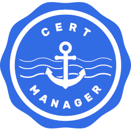

  

<!-- note that the cert-manager logo in this repo is referred to in other README files in the cert-manager org
     as well as in Helm charts, etc.
     if you change its location or name, you'll need to update several other repos too! -->

<a href="https://prow.infra.cert-manager.io/?job=ci-cert-manager-master-make-test">
<!-- prow build badge, godoc, and go report card-->

</a>

 

 

# cert-manager

cert-manager adds certificates and certificate issuers as resource types in Kubernetes clusters, and simplifies the process of obtaining, renewing and using those certificates.

It supports issuing certificates from a variety of sources, including Let's Encrypt (ACME), HashiCorp Vault, and Venafi TPP / TLS Protect Cloud, as well as local in-cluster issuance.

cert-manager also ensures certificates remain valid and up to date, attempting to renew certificates at an appropriate time before expiry to reduce the risk of outages and remove toil.

## Documentation

Documentation for cert-manager can be found at [cert-manager.io](https://cert-manager.io/docs/).

For the common use-case of automatically issuing TLS certificates for
Ingress resources, see the [cert-manager nginx-ingress quick start guide](https://cert-manager.io/docs/tutorials/acme/nginx-ingress/).

For a more comprehensive guide to issuing your first certificate, see our [getting started guide](https://cert-manager.io/docs/getting-started/).

### Installation

[Installation](https://cert-manager.io/docs/installation/) is documented on the website, with a variety of supported methods.

## Developing cert-manager

We actively welcome contributions and we support both Linux and macOS environments for development.

Different platforms have different requirements; we document everything on our [Building cert-manager](https://cert-manager.io/docs/contributing/building/)
website page.

Note in particular that macOS has several extra requirements, to ensure that modern tools are installed and available. Read the page before
getting started!

## Troubleshooting

If you encounter any issues whilst using cert-manager, we have a number of ways to get help:

- A [troubleshooting guide](https://cert-manager.io/docs/faq/troubleshooting/) on our website.
- Our official [Kubernetes Slack channel](https://cert-manager.io/docs/contributing/#slack) - the quickest way to ask! ([#cert-manager](https://kubernetes.slack.com/messages/cert-manager) and [#cert-manager-dev](https://kubernetes.slack.com/messages/cert-manager-dev))
- [Searching for an existing issue](https://github.com/cert-manager/cert-manager/issues).

If you believe you've found a bug and cannot find an existing issue, feel free to [open a new issue](https://github.com/cert-manager/cert-manager/issues)!
Be sure to include as much information as you can about your environment.

## Community

The `cert-manager-dev` Google Group is used for project wide announcements and development coordination.
Anybody can join the group by visiting [here](https://groups.google.com/forum/#!forum/cert-manager-dev)
and clicking "Join Group". A Google account is required to join the group.

### Meetings

We have several public meetings which any member of our Google Group is more than welcome to join!

Check out the details on [our website](https://cert-manager.io/docs/contributing/#meetings). Feel
free to drop in and ask questions, chat with us or just to say hi!

## Contributing

We welcome pull requests with open arms! There's a lot of work to do here, and
we're especially concerned with ensuring the longevity and reliability of the
project. The [contributing guide](https://cert-manager.io/docs/contributing/)
will help you get started.

## Coding Conventions

Code style guidelines are documented on the [coding conventions](https://cert-manager.io/docs/contributing/coding-conventions/) page
of the cert-manager website. Please try to follow those guidelines if you're submitting a pull request for cert-manager.

## Importing cert-manager as a Module

⚠️ Please note that cert-manager **does not** currently provide a Go module compatibility guarantee. That means that
**most code under `pkg/` is subject to change in a breaking way**, even between minor or patch releases and even if
the code is currently publicly exported.

The lack of a Go module compatibility guarantee does not affect API version guarantees
under the [Kubernetes Deprecation Policy](https://kubernetes.io/docs/reference/using-api/deprecation-policy/).

For more details see [Importing cert-manager in Go](https://cert-manager.io/docs/contributing/importing/) on the
cert-manager website.

The import path for cert-manager versions 1.8 and later is `github.com/cert-manager/cert-manager`.

For all versions of cert-manager before 1.8, including minor and patch releases, the import path is `github.com/jetstack/cert-manager`.

## Security Reporting

Security is the number one priority for cert-manager. If you think you've found a security vulnerability, we'd love to hear from you.

Follow the instructions in [SECURITY.md](./SECURITY.md) to make a report.

## Changelog

[Every release](https://github.com/cert-manager/cert-manager/releases) on GitHub has a changelog,
and we also publish release notes on [the website](https://cert-manager.io/docs/release-notes/).

## History

cert-manager is loosely based upon the work of [kube-lego](https://github.com/jetstack/kube-lego)
and has borrowed some wisdom from other similar projects such as [kube-cert-manager](https://github.com/PalmStoneGames/kube-cert-manager).

Logo design by [Zoe Paterson](https://zoepatersonmedia.com)
