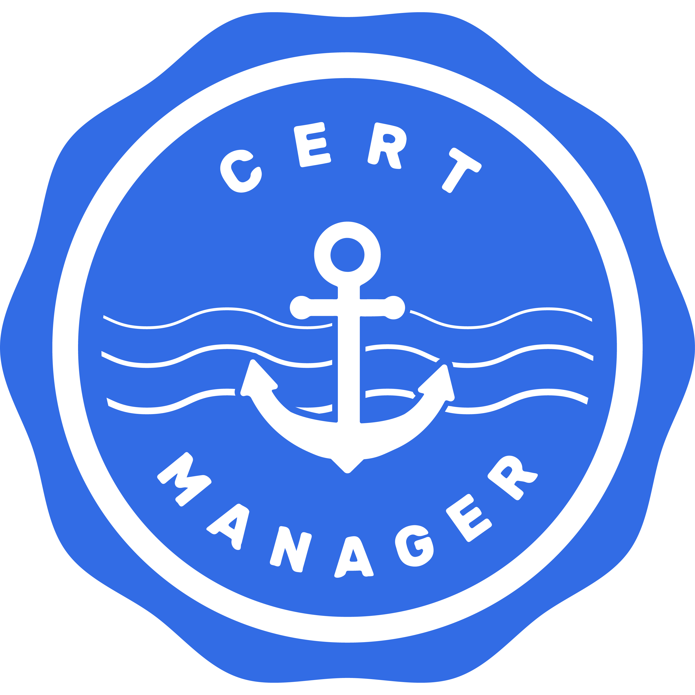

<a href="https://prow.build-infra.jetstack.net/?job=ci-cert-manager-bazel">
<!-- prow build badge, godoc, and go report card-->

</a>

 

# cert-manager

cert-manager is a Kubernetes add-on to automate the management and issuance of
TLS certificates from various issuing sources.

It will ensure certificates are valid and up to date periodically, and attempt
to renew certificates at an appropriate time before expiry.

It is loosely based upon the work of [kube-lego](https://github.com/jetstack/kube-lego)
and has borrowed some wisdom from other similar projects e.g.
[kube-cert-manager](https://github.com/PalmStoneGames/kube-cert-manager).

## Documentation

Documentation for cert-manager can be found at [cert-manager.io](https://cert-manager.io/docs/).
Please make sure to select the correct version of the documentation to view on
the top right of the page.

Issues and PRs towards the documentation should be filed in the [website repo](https://github.com/cert-manager/website/).

For the common use-case of automatically issuing TLS certificates to
Ingress resources, aka a [kube-lego](https://github.com/jetstack/kube-lego)
replacement, see the [cert-manager nginx ingress quick start
guide](https://cert-manager.io/docs/tutorials/acme/nginx-ingress/).

See [Installation](https://cert-manager.io/docs/installation/)
within the [documentation](https://cert-manager.io/docs)
for installation instructions.

## Troubleshooting

If you encounter any issues whilst using cert-manager, we have a number of places you
can use to try and get help.

First of all we recommend looking at the [troubleshooting guide](https://cert-manager.io/docs/faq/troubleshooting/) of our documentation.

The quickest way to ask a question is to first post on our Slack channel (#cert-manager)
on the [Kubernetes Slack](http://slack.kubernetes.io/).
There are a lot of community members in this channel, and you can often get an answer
to your question straight away!

You can also try [searching for an existing issue](https://github.com/cert-manager/cert-manager/issues).
Properly searching for an existing issue will help reduce the number of duplicates,
and help you find the answer you are looking for quicker.

Please also make sure to read through the relevant pages in the [documentation](https://cert-manager.io/docs/)
before opening an issue. You can also search the documentation using the search box on the
top left of the page.

If you believe you have encountered a bug, and cannot find an existing issue similar to your
own, you may [open a new issue](https://github.com/cert-manager/cert-manager/issues).
Please be sure to include as much information as possible about your environment.

## Community

The `cert-manager-dev` Google Group is used for project wide announcements and development coordination.
Anybody can join the group by visiting [here](https://groups.google.com/forum/#!forum/cert-manager-dev)
and clicking "Join Group". A Google account is required to join the group.

### Bi-weekly Development Meeting

Once you've joined the `cert-manager-dev` Google Group, you should receive an invite to the bi-weekly development
meeting, hosted every other Wednesday at [5pm London time](http://www.thetimezoneconverter.com/?t=17:00&tz=Europe/London) on Google Meet.

Anyone is welcome to join these calls, even if just to ask questions. Meeting notes are recorded in
[Google docs](https://docs.google.com/document/d/1Tc5t6ylY9dhXAan1OjOoldeaoys1Yh4Ir710ATfBa5U).

### Daily Standups

You are also welcome to join our daily standup every weekday at [10.30am London time](http://www.thetimezoneconverter.com/?t=10:30&tz=Europe/London)
on Google Meet. For more information, see [cert-manager.io](https://cert-manager.io/docs/contributing/).

## Contributing

We welcome pull requests with open arms! There's a lot of work to do here, and
we're especially concerned with ensuring the longevity and reliability of the
project.

Please take a look at our [issue tracker](https://github.com/cert-manager/cert-manager/issues)
if you are unsure where to start with getting involved!

We also use the #cert-manager and #cert-manager-dev channels on [Kubernetes Slack](https://kubernetes.slack.com)
for chat relating to the project.

Developer documentation is available on the [cert-manager.io website](https://cert-manager.io/docs/contributing/).

## Coding Conventions

Code style guidelines are documented on the [coding conventions](https://cert-manager.io/docs/contributing/coding-conventions/) page
of the cert-manager website. Please try to follow those guidelines if you're submitting a pull request for cert-manager.

## Importing cert-manager as a Module

⚠️ Please note that cert-manager **does not** currently provide a Go module compatibility guarantee. That means that
**most code under `pkg/` is subject to change in a breaking way**, even between minor or patch releases and even if
the code is currently publicly exported.

The lack of a Go module compatibility guarantee does not affect API version guarantees
under the [Kubernetes Deprecation Policy](https://kubernetes.io/docs/reference/using-api/deprecation-policy/).

For more details see [Importing cert-manager in Go](https://cert-manager.io/docs/contributing/importing/) on the
cert-manager website.

The import path for cert-manager versions 1.8 and later is `github.com/cert-manager/cert-manager`.

For all versions of cert-manager before 1.8, including minor and patch releases, the import path is `github.com/jetstack/cert-manager`.

## Security Reporting

Security is the number one priority for cert-manager. If you think you've found
a security vulnerability, we'd love to hear from you.

Please follow the instructions in [SECURITY.md](./SECURITY.md) to report a
vulnerability to the team.

## Changelog

The [list of releases](https://github.com/cert-manager/cert-manager/releases)
is the best place to look for information on changes between releases.

Logo design by [Zoe Paterson](https://zoepatersonmedia.com)
