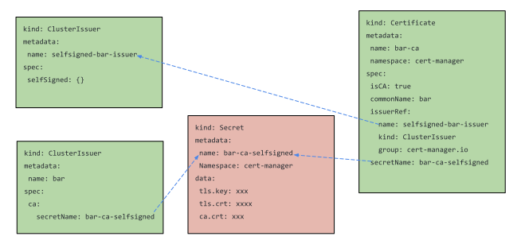
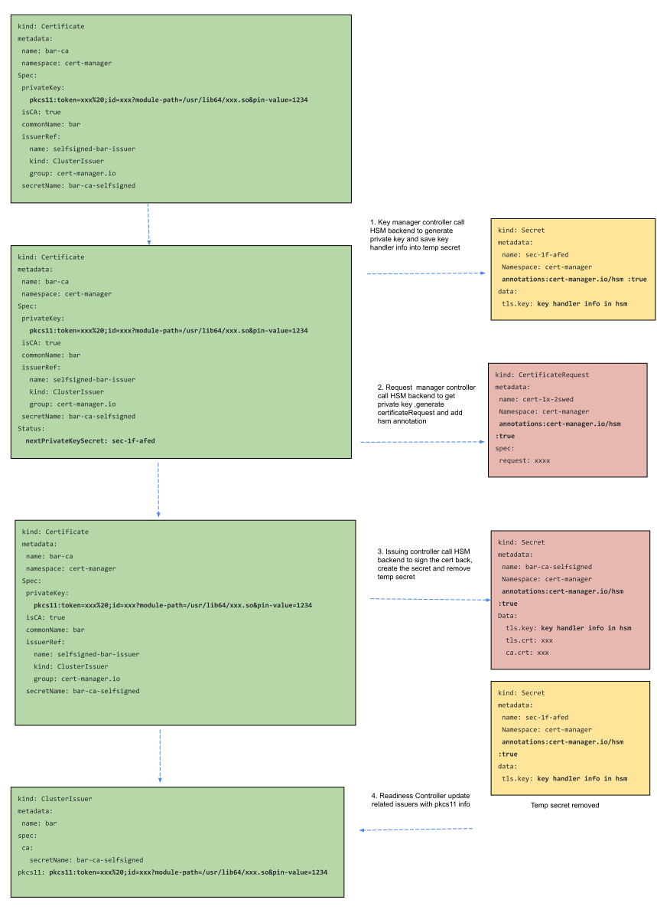

 
Support HSM in Cert-Manager for CA and Self-Signed issuers

Authors:  @kailun-qin, @irisdingbj 

Reviewers: 

creation-date: 2021-07-14 

last-updated: 2021-09-02

status: draft 

--- 

 

# Support HSM in Cert-Manager for CA and Self-Signed issuers 


## Summary 

A Hardware Security Module(HSM) is a device to generate, store and manage cryptographic keys safely. The functions of a Hardware Security Module include key generation, encryption & decryption, authentication and signing operations.

HSM uses PKCS#11 for signing and decrypting payloads without having direct access to the private keys. Only the reference to the underlying key is provided there by not exposing the key in memory (in the clear). 

Enhance cert-manager CA issuer and Self signed Issuers with HSM support.  

 

## Motivation 

 
Currently cert-manager CA issuer and self-signed issuer uses private key stored in the Secret to issue certificates. 
The private key will be cached and exposed in memory after fetching from etcd. Malicious software and/or hardware can extract those keys in the clear. 


## Reasons for Approach 


This mode is pluggable, no influence for all current functions if the user does not define  related PKCS11 info. 


--- 

 

## Proposal 

PKI functions in cert-manager like generate key pair, get Key pair and Sign will be enhanced to call HSM backend instead for CRs that has PKCS11 info defined. 

### Self-Signed Issuer

Self-signed issuer in cert-manager is majorly used to bootstrap a CA issuer. So it will work jointly with Certificate Custom resource.



One field  `Pkcs11` for `CertificatePrivateKey` in Certificate CRD will be added to let user specify PKCS11 URI info:

```
// CertificatePrivateKey contains configuration options for private keys
// used by the Certificate controller.
// This allows control of how private keys are rotated.
type CertificatePrivateKey struct { 
   Pkcs11 string  `json:"pkcs11,omitempty"`
  }
```
The Pkcs11 format shall be a PKCS #11 [URI](https://datatracker.ietf.org/doc/html/rfc7512) using `pkcs11`as prefix.   An example is like `pkcs11:token=xxx%20;id=xxx?module-path=/usr/lib64/xxx.so&pin-value=1234` 

1. Key Manager Controller will be enhanced to call HSM backend to generate private keys and using the returned key handler info to generate the temp secret. Some pseudocodes example: 
```
 config := parsePkcs11URI("pkcs11:token=xxx%20;id=xxx?module-path=/usr/lib64/xxx.so&pin-value=1234")
 context, err := crypto11.Configure(config)
 context.GenerateRSAKeyPair(xxx,xxx)
```


2. Request manager controller will be enhanced to create certificateRequest via hsm backend and add annotation `cert-manager.io/hsm :true`  for those certificates with pkcs11 info. 
 

3. Issuing controller will be enhanced call HSM backend to sign the CSR to save secrets with key handler info with keys saved in HSM. 
 
### CA Issuer

One field  `Pkcs11` for `IssuerConfig` in Issuer CRD will be added to let user specify PKCS11 URI info:

```
// The configuration for the issuer.
// Only one of these can be set.
type IssuerConfig struct {
  Pkcs11 string  `json:"pkcs11,omitempty"`
}
```
User needs to create secret with key handler info that can be retrieved via PKCS11 URI.
CA issuer will be enhanced to call HSM backend via PKCS11 URI info to find the correct key stored in HSM and  sign certs back. 
 
### Work Flow Diagram 


### Key retrieval 

 

With Crypto11 enabled, id and label are used as the identifiers to fetch the private key.  Either of them is usable to fetch the identical key.    

 

 ## Reference Standards

* [PKCS #11](https://www.oasis-open.org/news/announcements/four-pkcs-11-specifications-from-pkcs11-tc-approved-as-committee-specifications/)
* [PKCS #11 URI](https://datatracker.ietf.org/doc/html/rfc7512)

### Third Party Projects 

[SoftHSMv2](https://github.com/opendnssec/SoftHSMv2) from OpenDNSSEC project can be utilized to provide HSM support for upstream to demonstrate how to utilized HSM in cert-manager. Other hardware based solutions should work seamlessly as well.  
 
--- 
