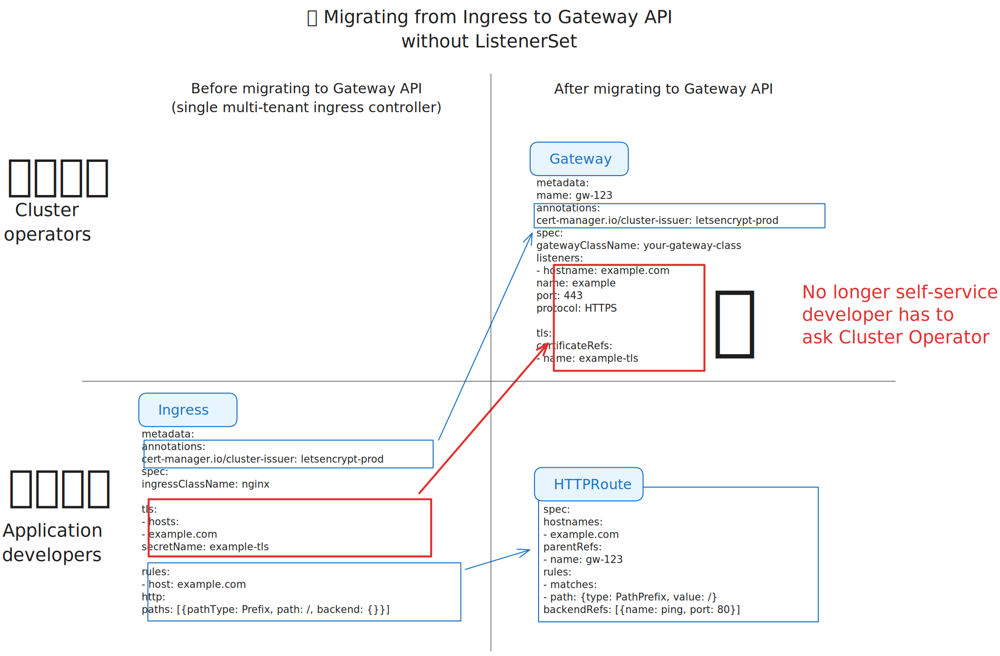

# TLS Self-Service for Gateway API: cert-manager + ListenerSet

- [Summary](#summary)
- [Motivation](#motivation)
  - [The ingress-nginx and InGate Ingress controllers going EOL](#the-ingress-nginx-and-ingate-ingress-controllers-going-eol)
  - [The ListenerSet Solution](#the-listenerset-solution)
  - [Locking down Gateway resources](#locking-down-gateway-resources)
  - [Why Gateway API was designed this way](#why-gateway-api-was-designed-this-way)
  - [Goals](#goals)
  - [Non-Goals](#non-goals)
- [Proposal](#proposal)
  - [User Stories](#user-stories)
    - [Story 1](#story-1)
    - [Story 2](#story-2)
  - [Notes, Constraints, and Caveats](#notes-constraints-and-caveats)
  - [Risks and Mitigations](#risks-and-mitigations)
- [Design Details](#design-details)
  - [Feature Flag](#feature-flag)
  - [Issuer Annotations](#issuer-annotations)
  - [Test Plan](#test-plan)
  - [Graduation Criteria](#graduation-criteria)
  - [Upgrade and Downgrade Strategy](#upgrade-and-downgrade-strategy)
  - [Supported Versions](#supported-versions)
- [Production Readiness](#production-readiness)
- [Drawbacks](#drawbacks)
- [Alternatives](#alternatives)
  - [Alternative 0: Devs and Ops coordination](#alternative-0-devs-and-ops-coordination)
  - [Alternative 1: Let Devs edit Gateways](#alternative-1-let-devs-edit-gateways)
  - [Alternative 2: Catch-all hostname + multiple certificates attached to the Gateway resource](#alternative-2-catch-all-hostname--multiple-certificates-attached-to-the-gateway-resource)
  - [Alternative 3: Dynamic creation of `listener` entries on the Gateway resource](#alternative-3-dynamic-creation-of-listenerentries-on-the-gateway-resource)
- [Appendix](#appendix)
  - [Example of migration using `ingress2gateway`](#example-of-migration-using-ingress2gateway)

## Summary

This proposal outlines the addition of ListenerSet support in cert-manager, enabling application developers to configure TLS settings independently of cluster operators within Gateway API. This capability addresses a limitation where developers transitioning from Ingress to Gateway API lose control over TLS configuration. This problem has been raised by the community in [cert-manager#7473][].

[cert-manager#7473]: https://github.com/cert-manager/cert-manager/issues/7473

ListenerSet was introduced in [GEP-1713](https://gateway-api.sigs.k8s.io/geps/gep-1713/) and is currently only available using the `X` (experimental) versions of the Gateway API CRDs.

> **⚠️ Important: XListenerSet is for testing only**
>
> The `X` prefix on `XListenerSet` indicates this is an experimental resource that may undergo breaking changes. This resource **should not be used in production**. When ListenerSet graduates to stable, migrating from `XListenerSet` to `ListenerSet` will require manual action (pulling down the object, changing the Kind and apiVersion, and re-adding a new object).
>
> However, implementing XListenerSet support in cert-manager now is critical because it allows Gateway API implementations to validate one of the most common use cases (TLS self-service) before the resource graduates to stable. This early implementation helps ensure the design is correct and accelerates the path to a stable ListenerSet API.

## Motivation

Application developers previously using Ingress could configure both routing and TLS certificates independently. When moving to Gateway API, the TLS configuration is now centralized in the Gateway resource, typically controlled by the cluster operator (see [Locking down Gateway resources](#locking-down-gateway-resources)). This change restricts developers, who can no longer configure TLS in a self-service way.

Here's a diagram illustrating the problem of loss of self-service from the point of view of application developers:



### The ingress-nginx and InGate Ingress controllers going EOL

In November 2025, the Kubernetes community announced that ingress-nginx's Ingress support [will reach End-of-Life by March 2026](https://kubernetes.io/blog/2025/11/11/ingress-nginx-retirement/). The official migration path recommends "Consider migrating to Gateway API." Most organizations running ingress-nginx (and many other Ingress controllers) use a single, shared Ingress controller for all teams. This multi-tenant model has several advantages:

- Single point of infrastructure management,
- Shared cloud load balancer costs,
- Centralized certificate management,
- Consistent policy enforcement.

Unfortunately, the announcement doesn't make it clear to users relying on the multi-tenant Ingress controller model that cert-manager is currently incompatible with Gateway API when migrating away from the multi-tenant model. When these users try to migrate to Gateway API, they face difficult choices:

1. **Single shared Gateway per cluster**: Mimics their current multi-tenant setup, but developers lose the ability to self-service their TLS configuration. The Gateway resource (which holds TLS config) must be cluster operator-controlled, forcing developers to file tickets for every hostname change.

2. **One Gateway per team/namespace**: Restores developer self-service, but:
   - For cloud-backed implementations (AWS ALB, GKE, Azure AppGW), this means provisioning a separate cloud load balancer per team, increasing infrastructure costs;
   - For implementations that create pods per Gateway (like Istio), this means pod sprawl;
   - Most organizations cannot justify this cost increase just to maintain developer autonomy.

Users following the official Kubernetes migration guidance will be forced to either lose developer self-service or increase their infrastructure costs.

### The ListenerSet Solution

ListenerSet (introduced in [GEP-1713][]) solves this by decoupling TLS configuration from the Gateway resource, allowing:

[GEP-1713]: https://gateway-api.sigs.k8s.io/geps/gep-1713/

- A single shared Gateway per cluster (keeping infrastructure costs low)
- Developer self-service for TLS certificates (via ListenerSet)
- Maintaining the intended separation of concerns between cluster operators and application developers

Without ListenerSet support in cert-manager, the ingress-nginx EOL deadline becomes a crisis for organizations that need both cost-effective infrastructure and developer autonomy.

Two workarounds have been found by cluster operators who don't want to wait for ListenerSet:

- **Using a wildcard certificate as hostname on the Gateway:** Gateway API intentionally supports wildcard certificates with a secure design: the wildcard private key stays isolated in a privileged namespace (e.g., `gateway-system`), and Gateway owners reference it via a ReferenceGrant without being able to read the key itself. However, when cert-manager creates wildcard certificates for this workaround, it typically places the Secret in the same namespace as the Gateway or uses cluster-wide permissions, bypassing the ReferenceGrant isolation model. This means developers can read the wildcard private key directly, introducing the risks associated with wildcard certificate exposure (cf. [OWASP notes](https://cheatsheetseries.owasp.org/cheatsheets/Transport_Layer_Security_Cheat_Sheet.html#carefully-consider-the-use-of-wildcard-certificates) on using wildcard certificates).
- **Letting developers edit the Gateway resource:** this solution increases the attack surface and breaks Gateway API's goal of being an API boundary between cluster operators and application developers.

ListenerSet provides a mechanism allowing developers to manage TLS configurations, restoring self-service capabilities akin to Ingress. The following diagram illustrates the fact that developers can now configure TLS by creating ListenerSet objects themselves (provided that the correct RBAC permissions are in place):


### Locking down Gateway resources

The reason cluster operators want to lock down the Gateway resource is because some implementations of Gateway API create costly resources.
In the table below, the ListenerSet use-case would fix the four first entries for which it would be unsafe for developers to be able to create Gateway objects:

| **Implementation**                     | **Safe for Devs to Create Gateways?** | **Why?**                                                                                                                                                                                                                      |
|-----------------------------------------|----------------------------------------|--------------------------------------------------------------------------------------------------------------------------------------------------------------------------------------------------------------------------------|
| AWS Gateway API controller              | ❌ No                                  | Each Gateway provisions a new AWS ALB/NLB (cloud load balancer), which incurs cost per hour.                                                                                                                                   |
| GKE Gateway API                         | ❌ No                                  | Each Gateway provisions a new Google Cloud Load Balancer; charges apply for every LB created.                                                                                                                                  |
| Azure Application Gateway controller    | ❌ No                                  | Each Gateway provisions a new Azure Application Gateway (cloud load balancer) with associated costs.                                                                                                                           |
| F5 BIG-IP (CNE) Gateway controller      | ❌ No                                  | Each Gateway maps to a new virtual server/pool on BIG-IP, consuming license slots and appliance capacity.                                                                                                                       |
| Contour                                 | ✅ Yes                                 | Gateways are just config updates; all traffic goes through a shared Envoy Deployment. No new pods created.                                                                                                                     |
| Istio                                   | ✅ Yes (but pods per Gateway)          | Each Gateway creates a new Envoy Deployment, but it's still cheap (no external infra provisioned).                                                                                                                              |
| NGINX Gateway Fabric                    | ✅ Yes                                 | Gateways reuse the same NGINX Deployment; no extra pods or infra per Gateway.                                                                                                                                                   |
| Envoy Gateway                           | ✅ Yes                                 | Gateways share the same Envoy fleet unless you configure isolation; no new pods. Usually, people will use `mergeGateways` whereby all Gateways referring to the same GatewayClass are merged and served by the same set of Envoy Proxies. |
| ingress-nginx (Gateway API mode)        | ✅ Yes                                 | Gateways reuse existing ingress-nginx pods; no new deployments are created per Gateway.                                                                                                                                        |
| Cilium Service Mesh (w/o Cilium LB-IPAM)| ❌ No                                  | Depends on how Loadbalancer Services are handled at Layer 4 in the cluster. If the cluster provisions new cloud LBs for each LB Service, then each Gateway will provision a new Cloud LB, because Gateways all create LB Services for attracting traffic to Cilium Nodes.|
| Cilium Service Mesh (w/ Cilium LB-IPAM) | ✅ Yes                                 | Gateways are purely logical; routing happens in eBPF in kernel. No pods or infra created. Extra VIPs are free with LB-IPAM.                                                                                                     |
| InGate                                  | ✅ Yes                                 | Purely logical; no pods or external infra created.                                                                                                                                                                              |
| Traefik Gateway API implementation      | ✅ Yes                                 | Gateways are config-only; Traefik reuses its existing Deployment.                                                                                                                                                               |
| Kong Gateway (DB-less)                  | ✅ Yes                                 | Purely logical; Kong reuses existing proxy pods with no new infra created per Gateway.                                                                                                                                          |

### Why Gateway API was designed this way

While this may seem like a step backward for developer velocity, the Gateway API design intentionally addresses two major concerns with the Ingress API:

**Traffic hijacking protection:** with the Ingress API, one team can accidentally or maliciously capture traffic intended for another team by creating an Ingress with the same hostname but different TLS configuration. This often happens in larger clusters with many teams, where conflicting Ingress objects can silently intercept traffic meant for other services.

**Certificate cost concerns:** as [Nick Young explained](https://www.reddit.com/r/kubernetes/comments/1p613rp/comment/nqnlmh4/), when Gateway API was first designed, certificates were expensive assets bought from Verisign or similar providers, costing thousands of dollars each. You absolutely didn't want app developers touching or owning those certificates.

These two concerns led to centralizing TLS configuration at the Gateway level under cluster admin control. This centralization still makes sense for restricting the use of wildcard certificates. However, Let's Encrypt and cert-manager helped break the certificate monopoly, making it acceptable for app developers to "own" their certificates by requesting automated issuance.

ListenerSet emerged as the community's solution to restore developer self-service while letting infrastructure admins choose whether to grant that capability based on their security posture. For more details on the design rationale, you can read the page: [Key differences between Ingress API and Gateway API](https://gateway-api.sigs.k8s.io/guides/migrating-from-ingress/#key-differences-between-ingress-api-and-gateway-api).

### Goals

- Reduce the risks associated with wildcard certificates by using hostname-specific certificates instead.
  (One of the two workarounds commonly deployed by cluster operators to enable self-service.)
- Reduce the attack surface caused by giving everyone edit permission on Gateway objects.
  (One of the two workarounds commonly deployed by cluster operators to enable self-service.)
- Enable application developers to independently configure TLS certificates, similar to what Ingress offered.
- Maintain the separation of concerns between cluster operators (Gateway resource) and developers (ListenerSet and HTTPRoute resources).
- Provide flexible issuer configuration per hostname or ListenerSet, allowing multiple issuers per Gateway.

### Non-Goals

- Modifying core Gateway API behavior beyond integration with cert-manager.
- Implementing features unrelated to cert-manager annotations or TLS certificate management.

## Proposal

Add support for ListenerSet resources within cert-manager, allowing TLS certificate annotations to be placed directly on ListenerSets rather than exclusively on Gateway objects. This will enable self-service TLS configuration by developers without compromising infrastructure control by operators.

### User Stories

#### Story 1

As a platform admin, I worry about ingress-nginx's Ingress support being EOL ([https://github.com/cert-manager/cert-manager/issues/7822](https://github.com/cert-manager/cert-manager/issues/7822)) and I need to be able to use `ingress2gateway` to migrate from ingress-nginx + Ingress to InGate's Gateway API implementation. An example of such migration is given [in appendix](#example-using-ingress2gateway).

#### Story 2

As an application developer, I want to configure TLS certificates independently without coordinating with the platform admin, enabling rapid deployment.

### Notes, Constraints, and Caveats

- Adding this feature would first require us to support Gateway API's `X`
  versions of the API (just XListenerSet for now, since XGateway and XHTTPRoute
  don't exist yet).
- Annotation precedence (ListenerSet vs. Gateway) must be clearly defined.

### Risks and Mitigations

- **Risk**: Confusion over issuer annotation priority between Gateway and ListenerSet.

  - **Mitigation**: Document clear precedence rules (ListenerSet annotations override Gateway annotations).

- **Risk**: Increased complexity for cert-manager due to additional API surface.

  - **Mitigation**: Comprehensive testing and clear documentation.

## Design Details

### Feature Flag

The first step is to add support for `X` resource in cert-manager through a new
feature flag:

```
--feature-gates XListenerSets=true
```

The second is to support ListenerSet objects and their annotations by extending
cert-manager's internal logic to process ListenerSet resources similarly to
Gateway annotations. ListenerSet annotations will override Gateway annotations
if present.

To use the feature, users will have to pass:

```
--enable-gateway-api --feature-gates XListenerSets=true
```

### Issuer Annotations

What about a Gateway resource with the `cert-manager.io/issuer` and a listener
set with the `cert-manager.io/cluster-issuer` annotation?

- If the Gateway object already has the issuer annotation, the ListenerSets
  attached to it may omit the issuer annotation: the Gateway's annotation acts
  as a default for any ListenerSet attached to it.
- If the Gateway object already has an issuer annotation, a given ListenerSet
  can override the Gateway's annotation by specifying its own
  `cert-manager.io/issuer` or `cert-manager.io/cluster-issuer` annotation.
- Even if a Gateway doesn't have any default issuer annotation, a ListenerSet
  can still specify its own `cert-manager.io/issuer` or
  `cert-manager.io/cluster-issuer` annotation.
- The Gateway's issuer annotation is always used to populate the secret in the
  Gateway's `certificateRefs`.

### Test Plan

- Unit tests to validate ListenerSet annotation handling.
- Integration tests to ensure proper interaction with Gateway and ListenerSet
  resources.
- End-to-end tests simulating realistic deployment scenarios using InGate's
  Gateway API implementation.

### Graduation Criteria

**Alpha:**

- Implement feature behind a feature flag.
- Clearly define supported Kubernetes and Gateway API versions.
- All CI tests passing.

**Beta:**

- Feature flag is turned on by default.

### Upgrade and Downgrade Strategy

- Feature flag to control activation.
- Safe rollback by disabling feature flag if issues arise.

### Supported Versions

- Kubernetes 1.27+
- Gateway API version supporting ListenerSet (experimental, v1alpha1 initially)

## Production Readiness

| Question | Answer |
|---|---|
| How can this feature be enabled or disabled for an existing cert-manager installation? | Feature gate `--feature-gates XListenerSets=true` will control enabling/disabling reconciling `XListenerSet` resources. |
| Does this feature depend on any specific services running in the cluster? | Requires the "X" (experimental) version of Gateway API CRDs. |
| Will using this feature result in new API calls? | N/A |
| Will using this feature result in increasing size or count of existing API objects? | No. |
| Will using this feature result in significant increase of resource usage? | No. |

## Drawbacks

- Adds complexity to cert-manager's Gateway integration.
- Potential confusion around annotation precedence.

## Alternatives

### Alternative 0: Devs and Ops coordination

You can already do that today: the developer creates an HTTPRoute, and then asks
the Platform team to add a new entry under `listeners` on the Gateway
resource. This solution isn't practical.

### Alternative 1: Let Devs edit Gateways

Another approach would be to relax the RBAC to let developers create the
listener for their HTTPRoute themselves. This solution goes against the design
goals of Gateway API.

Some Gateway API implementations such as envoy-gateway make it possible since Gateways don't need to be shared. 

But for most other implementations (such as Google's GKE Gateway controller) represent actual infra that cost money (IPs, Google Cloud Load Balancers...); these are shared across teams and are owned by cluster operators: devs can't edit Gateway objects.


### Alternative 2: Catch-all hostname + multiple certificates attached to the Gateway resource

The idea would be to have a single "catch all" listener. Each HTTPRoute would add its own entries to the `certificateRefs`:

```yaml
kind: Gateway
spec:
  gatewayClassName: nginx
  listeners:
    - hostname: "" # Catch-all
      name: catch-all-listener
      port: 443
      protocol: HTTPS
      tls:
        certificateRefs:
          - name: route-1-tls
          - name: route-2-tls
          - name: route-3-tls
```

This approach wasn't pursued because "Core" Gateway API only supports a single
entry in `certificateRefs`. This limitation stems from the fact that Gateway API's
authors aim to have as much configuration as possible structured and explicit (i.e., in API fields
rather than in undocumented annotations or, even worse, embedded in annotations as JSON blobs).
Having multiple certificates under `certificateRefs` defeats this goal since implementations
would have to parse each cert to know what certificate should be handed to the client, rather
than just having to look at the Gateway object.

This alternative has also been proposed in [20230601.gateway-route-hostnames.md](https://github.com/cert-manager/cert-manager/blob/master/design/20230601.gateway-route-hostnames.md) with the idea of avoiding the duplication of hostnames that are both present in Gateway and HTTPRoute objects.

### Alternative 3: Dynamic creation of `listener` entries on the Gateway resource

Similarly to the alternative 1, we could imagine letting cert-manager create 443 listeners dynamically, e.g.:

```yaml
kind: Gateway
spec:
  gatewayClassName: nginx
  listeners:
    - name: route-1-1
      hostname: foo.com
      port: 443
      protocol: HTTPS
      tls: { certificateRefs: [{ name: route-1-1-tls }] }
    - name: route-2-1
      hostname: bar.com
      port: 443
      protocol: HTTPS
      tls: { certificateRefs: [{ name: route-2-1-tls }] }
```

## Appendix

### Example of migration using `ingress2gateway`

Let's look at an example of Ingress resource, developers are able to manage both the HTTP and TLS side of things, including configuring cert-manager:

```yaml
apiVersion: networking.k8s.io/v1
kind: Ingress
metadata:
  annotations:
    cert-manager.io/cluster-issuer: letsencrypt-prod
  name: foo
  namespace: default
spec:
  ingressClassName: nginx
  rules:
    - host: foo.com
      http:
        paths:
          - pathType: Prefix
            path: /
            backend:
              service:
                name: ping
                port:
                  number: 80
  tls:
    - hosts:
        - foo.com
      secretName: foo-tls
---
apiVersion: networking.k8s.io/v1
kind: Ingress
metadata:
  annotations:
    cert-manager.io/cluster-issuer: letsencrypt-prod
  name: bar
  namespace: default
spec:
  ingressClassName: nginx
  rules:
    - host: bar.com
      http:
        paths:
          - pathType: Prefix
            path: /
            backend:
              service:
                name: ping
                port:
                  number: 80
  tls:
    - hosts:
        - bar.com
      secretName: bar-tls
```

When moving to Gateway and HTTPRoute objects, developers can no longer manage the TLS and cert-manager configuration as they can only create and edit HTTPRoutes.

> I've used the [ingress2gateway](https://github.com/kubernetes-sigs/ingress2gateway) tool to convert the above Ingress. Command used:
>
> ```bash
> ingress2gateway print --providers ingress-nginx --input-file ingress.yaml | yq 'del(.. | select(length==0))'
> ```

```yaml
apiVersion: gateway.networking.k8s.io/v1
kind: Gateway
metadata:
  annotations:
    # Note that ingress2gateway doesn't actually keep
    # the cert-manager annotations. I've re-added it.
    cert-manager.io/cluster-issuer: letsencrypt-prod
  name: nginx
  namespace: default
spec:
  gatewayClassName: nginx
  listeners:
    - hostname: foo.com
      name: foo-com-http
      port: 80
      protocol: HTTP
    - hostname: foo.com
      name: foo-com-https
      port: 443
      protocol: HTTPS
      tls:
        certificateRefs:
          - name: foo-tls # ✨ Managed by cert-manager
    - hostname: bar.com
      name: bar-com-http
      port: 80
      protocol: HTTP
    - hostname: bar.com
      name: bar-com-https
      port: 443
      protocol: HTTPS
      tls:
        certificateRefs:
          - name: bar-tls # ✨ Managed by cert-manager
---
apiVersion: gateway.networking.k8s.io/v1
kind: HTTPRoute
metadata:
  name: foo-foo-com
  namespace: default
spec:
  hostnames:
    - foo.com
  parentRefs:
    - name: nginx
  rules:
    - backendRefs:
        - name: ping
          port: 80
      matches:
        - path:
            type: PathPrefix
            value: /
---
apiVersion: gateway.networking.k8s.io/v1
kind: HTTPRoute
metadata:
  name: bar-bar-com
  namespace: default
spec:
  hostnames:
    - bar.com
  parentRefs:
    - name: nginx
  rules:
    - backendRefs:
        - name: ping
          port: 80
      matches:
        - path:
            type: PathPrefix
            value: /
```

With the ListenerSet, it looks like this:

```yaml
apiVersion: gateway.networking.k8s.io/v1
kind: Gateway
metadata:
  name: parent
  namespace: default
spec:
  gatewayClassName: nginx
  listeners: []
  allowedListeners:
  - from: Same # = same namespace
---
apiVersion: gateway.networking.x-k8s.io/v1alpha1
kind: XListenerSet
metadata:
  name: foo
  namespace: default
  annotations:
    cert-manager.io/cluster-issuer: ca-issuer
spec:
  parentRef:
    name: parent
  listeners:
  - name: foo
    hostname: foo.com
    protocol: HTTPS
    port: 443
    tls:
      mode: Terminate
      certificateRefs:
      - kind: Secret
        name: foo-tls # ✨ Managed by cert-manager
---
apiVersion: gateway.networking.k8s.io/v1
kind: HTTPRoute
metadata:
  name: foo-foo-com
spec:
  hostnames:
    - foo.com
  parentRefs:
    - name: nginx
  rules:
    - backendRefs:
        - name: ping
          port: 80
      matches:
        - path:
            type: PathPrefix
            value: /
---
apiVersion: gateway.networking.x-k8s.io/v1alpha1
kind: XListenerSet
metadata:
  name: bar
  annotations:
    cert-manager.io/cluster-issuer: letsencrypt-prod
spec:
  parentRef:
    name: parent
    namespace: default
  listeners:
  - name: bar
    hostname: bar.com
    protocol: HTTPS
    port: 443
    tls:
      mode: Terminate
      certificateRefs:
      - kind: Secret
        name: bar-tls # ✨ Managed by cert-manager
---
apiVersion: gateway.networking.k8s.io/v1
kind: HTTPRoute
metadata:
  name: bar-bar-com
spec:
  hostnames:
    - bar.com
  parentRefs:
    - name: nginx
  rules:
    - backendRefs:
        - name: ping
          port: 80
      matches:
        - path:
            type: PathPrefix
            value: /
```
