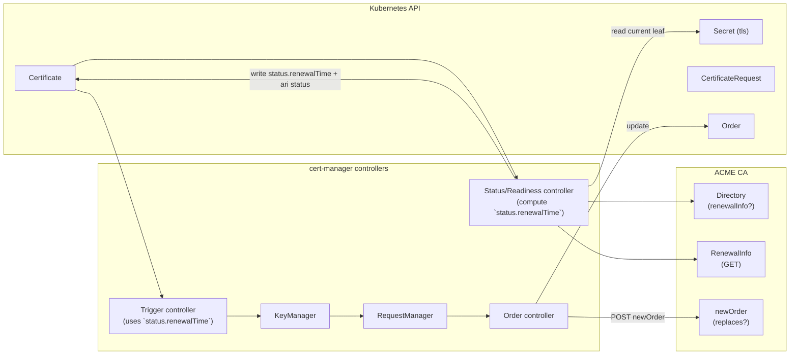

# Design: Integrate ACME ARI (RFC 9773) into cert-manager

> Draft (2026-03-04)  
> Feature gate (proposed): `ACMEARI`  
> Applies to: ACME Issuer / ClusterIssuer only  

## Author
- @hjoshi123 - Hemant Joshi

## Table of Contents

- [Summary](#summary)
- [Goals](#goals)
- [Non-Goals](#non-goals)
- [Terminology](#terminology)
- [High Level Architecture](#high-level-architecture)
  - [Controller flow](#controller-flow)
  - [Key Idea](#key-idea)
  - [Status fields](#status-fields)
- [Graduation Criteria](#graduation-criteria)
- [Risks and Mitigations](#risks-and-mitigations)

## Summary

This design integrates **ACME Renewal Information (ARI)** into cert-manager so that ACME-issued certificates renew at times suggested by the CA, while **also respecting operator-defined renewal windows**.

Key behaviors:

- If the ACME CA advertises ARI (`renewalInfo` in directory), cert-manager periodically fetches RenewalInfo for the currently issued certificate.
- cert-manager selects a renewal instant inside ARI’s `suggestedWindow` (uniform random).
- When placing a renewal order, include ARI’s `replaces` field on newOrder (if ARI supported), using the CertID of the currently issued leaf.

### Goals

- Respect CA guidance for renewal timing (ARI).
- Respect user-defined renewal windows.
- Avoid any behavioral change when ARI unsupported or feature disabled.
- Keep the rest of cert-manager’s renewal pipeline unchanged by driving everything through `Certificate.status.renewalTime`.

### Non-goals

- ARI for non-ACME issuers.
- Changing issuance/challenge logic beyond adding `replaces`.
- Persisting ARI state outside Kubernetes objects.

## Terminology

- **ARI CertID**: `base64url(AKI) + "." + base64url(serial)` derived from the currently issued leaf certificate.
- **ARI suggestedWindow**: `[start, end]` returned by RenewalInfo.
- **User renewal windows**: `spec.renewal.windows` (cron, duration, timezone).

### Process

- ACME Directory may include: `renewalInfo: "<url>"`.
- RenewalInfo endpoint is **unauthenticated GET**:
  - `GET {renewalInfo}/{base64url(AKI)}.{base64url(serial)}`
- Response: `suggestedWindow: { start, end }`, optional `explanationURL`.
- Response header: `Retry-After` indicates next time to re-query RenewalInfo.
- During renewal, client may include `replaces: "<CertID>"` in newOrder payload.

## High-level architecture

We keep the existing controller graph. The only difference is **how `status.renewalTime` is computed** for ACME certs when ARI is available.

### Controller flow



### Key idea

Reuse existing cert-manager renewal pipeline by **setting `Certificate.status.renewalTime` from ARI**.

- **Readiness/Status controller** (or whichever controller currently computes `renewalTime`) becomes responsible for:
  - Fetching RenewalInfo (when due).
    - When determining the next RenewalInfo fetch, if the CA returns a `Retry-After` header, use it; otherwise, fall back to a default polling interval (e.g., 24 hours, configurable).
    - To avoid thundering herd effects (many certificates polling at the same instant), cert-manager SHOULD add random jitter (e.g., ±10%) to the next RenewalInfo check time, whether derived from Retry-After or the default interval.
  - Selecting a randomized renewal instant in the suggested window.
    - If `spec.renewal.windows` is configured, cert-manager constrains the selected time to an allowed window:
        - Prefer a time in the intersection `ARI window ∩ user windows`.
        - If no intersection exists, fall back to the earliest user-window time ≥ ARI start (if possible before expiry).
        - If renewal cannot be scheduled under windows before expiry, surface the same “window error” semantics. (Ready=False + reason/message).
  - Writing `status.renewalTime` and ARI-related status.
- **Trigger controller** continues to use `status.renewalTime` to start issuance.
- **ACME issuer/order code** includes `replaces` when placing renewal orders.

### Status fields

This design also aims to introduce the below fields in status to support ARI and let the controllers consume it:

- status.acme.ari.suggestedWindow.start/end — the last fetched CA window
- status.acme.ari.explanationURL — optional CA explanation link
- status.acme.ari.lastChecked — when we last fetched RenewalInfo
- status.acme.ari.nextCheck — when we should fetch next (derived from Retry-After, bounded)
- status.renewalTime — renewal time calculated as usual.

## Security and Privacy Considerations

### RenewalInfo Fetching
- **Certificate Identifier Exposure**: Fetching RenewalInfo requires sending the CertID (derived from the certificate's AKI and serial) to the CA. This is expected by the protocol, but operators should be aware that this reveals which certificates are deployed.
- **CA Misbehavior**: If a CA provides misleading or malicious ARI data (e.g., extremely short or long windows, or misleading Retry-After), cert-manager will follow the protocol but will always enforce user-defined renewal windows and expiry limits as a safeguard.
- **Data Retention**: cert-manager does not persist ARI state outside Kubernetes objects, minimizing privacy risk.
- **Network Security**: RenewalInfo requests should be made over HTTPS to prevent interception or tampering.

### Retry-After Handling
- **Missing Retry-After**: If the CA does not return a Retry-After header in the RenewalInfo response, cert-manager SHOULD fall back to a default polling interval (e.g., 24 hours), configurable via a controller flag or setting. This prevents excessive polling and respects CA/server load.

## Example: Certificate Status with ARI

Here is an example of a Certificate resource status with ARI fields populated:

```yaml
status:
  renewalTime: "2026-07-01T12:34:56Z"
  acme:
    ari:
      suggestedWindow:
        start: "2026-06-30T00:00:00Z"
        end: "2026-07-02T00:00:00Z"
      explanationURL: "https://ca.example.com/renewal-info/why"
      lastChecked: "2026-06-25T10:00:00Z"
      nextCheck: "2026-06-26T10:00:00Z"
```

## Graduation Criteria

**Alpha:**

- Feature implemented behind the `ACMEARI` feature gate (disabled by default).
- Unit and integration tests cover ARI fetch, renewal time selection, `replaces` field inclusion, and fallback behavior when ARI is unavailable.

**Beta:**

- Feature gate `ACMEARI` is enabled by default.
- Gather feedback from early adopters on ARI interaction with `spec.renewal.windows` and edge cases (e.g., proxy-blocked ARI endpoints, short-lived certificates).
- Documentation published on [cert-manager/website] covering configuration, observability (`status.acme.ari` fields, `ARIFetchFailed` events), and troubleshooting.

**GA:**

- At least two examples of real-world usage with different ACME CAs that support ARI (e.g., Let's Encrypt, other RFC 9773-compliant CAs).
- Allowing time for feedback (at least one cert-manager minor release in beta).
- Confidence that the `status.acme.ari` API surface is stable and does not require breaking changes.

## Risks and Mitigations

- **Risk**: The ARI `suggestedWindow` may not overlap with operator-defined renewal windows (`spec.renewal.windows`). If no feasible time exists before the certificate’s `notAfter`, cert-manager cannot schedule renewal and the certificate could eventually expire.
    
    **Mitigation(s)**:
    - Attempt scheduling within the intersection `ARI window ∩ user windows`.
    - If the intersection is empty, select the earliest feasible time in user windows that is **≥ ARI start**.
    - If no feasible time exists before `notAfter`, surface a **WindowError event** (consistent with PR #8258 behavior), but continue the renewal with a time between: [`suggestedStart`, `suggestedEnd`)

- **Risk**: ARI requests fail permanently (e.g. a corporate proxy allows ACME traffic but blocks the `renewalInfo` endpoint), causing cert-manager to never receive CA renewal guidance.

    **Mitigation(s)**:
    - ARI is a suggestion/recommendation.. Any ARI fetch failure (network error, proxy block, DNS failure, HTTP 4xx/5xx, malformed response, invalid `suggestedWindow`) is **non-fatal**: cert-manager falls back to computing `renewalTime` from `spec.renewalTime` / `spec.duration`, as if ARI were not supported. **Certificates will still renew on time.**
    - A Kubernetes `Warning` event with reason `ARIFetchFailed` is emitted on each failed fetch (rate-limited to avoid event spam), giving operators visibility into the problem.
    - `status.acme.ari.lastChecked` will stop advancing, making staleness observable.
    - Operators who want to suppress the repeated warning events can disable the `ACMEARI` feature gate to opt out entirely.
    - The full set of failure modes and their responses:

      | Failure | cert-manager behaviour |
      |---|---|
      | Endpoint unreachable (network error, proxy block, DNS failure) | Warn event; fall back to standard renewal time; retry at `nextCheck` |
      | HTTP 4xx (e.g. 404 – CertID unknown to CA) | Treat ARI as unsupported for this certificate; clear ARI status fields; fall back |
      | HTTP 5xx or timeout | Exponential back-off up to the default polling interval; fall back until next successful fetch |
      | Malformed / unparseable response | Warn event; fall back; retry at `nextCheck` |
      | `suggestedWindow` in the past or `start >= end` | Ignore window; warn; fall back |
      | `Retry-After` unreasonably large (> certificate lifetime) | Clamp to configurable maximum (default: 7 days) |
      | `Retry-After` unreasonably small (< 1 minute) | Clamp to configurable minimum (default: 1 hour) |

- **Risk**: `replaces` field cannot be set on newOrder because ARI fetching has been failing.

    **Mitigation**: The `replaces` field is derived **locally** from the currently issued certificate's CertID (AKI + serial). It does not depend on a successful RenewalInfo fetch and will be included in newOrder regardless of ARI failures, as long as the CA's directory advertises `renewalInfo`.

