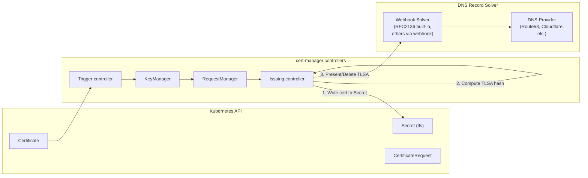

# Design: DANE/TLSA DNS Record Management

> Draft (2026-07-20)
> Feature gate (proposed): `DANETLSA`

## Author

- @rossigee

## Table of Contents

- [Summary](#summary)
- [Motivation](#motivation)
  - [Goals](#goals)
  - [Non-Goals](#non-goals)
- [Terminology](#terminology)
- [Proposed API](#proposed-api)
  - [CRD Snippet](#crd-snippet)
  - [Field Definitions](#field-definitions)
- [High Level Architecture](#high-level-architecture)
  - [Controller Flow](#controller-flow)
  - [DNS Record Solver Interface](#dns-record-solver-interface)
  - [TLSA Hash Computation](#tlsa-hash-computation)
  - [Record Lifecycle](#record-lifecycle)
- [Example Certificate Resources](#example-certificate-resources)
- [Graduation Criteria](#graduation-criteria)
- [Risks and Mitigations](#risks-and-mitigations)
- [Test Plan](#test-plan)
- [Alternatives Considered](#alternatives-considered)
- [Related Issues](#related-issues)

## Summary

This design adds optional TLSA DNS record management to cert-manager, enabling
DANE (DNS-Based Authentication of Named Entities, RFC 6698/7671) for TLS
certificate authentication. When enabled on a Certificate resource, cert-manager
automatically creates, updates, and deletes TLSA records in DNS after certificate
issuance and renewal.

DANE allows DNSSEC-signed TLSA records to bind TLS server certificates to DNS,
providing an additional layer of authentication beyond the traditional PKI trust
model. This is particularly valuable for SMTP DANE (RFC 7672) and HTTPS DANE.

## Motivation

DANE (RFC 6698) provides a mechanism to bind TLS certificates to DNS using
TLSA records, authenticated by DNSSEC. This enables certificate consumers to
verify that a certificate was authorized by the domain owner, not just by a
Certificate Authority.

Use cases driving this feature request:

- **SMTP DANE (RFC 7672)**: MTA-to-MTA TLS authentication using TLSA records
  on port 25. This is increasingly required for email infrastructure.
- **HTTPS DANE**: Web browsers and API clients can verify server certificates
  against TLSA records, providing protection against compromised CAs.
- **Internal PKI**: Organizations with private CAs can use DANE to bind
  certificates to DNS without relying on public CA trust stores.

cert-manager already manages the full certificate lifecycle (issuance, renewal,
revocation) and has extensive DNS provider support via the ACME DNS-01 solver
webhook system. Extending this to manage TLSA records is a natural fit.

The primary use case driving this feature request is SMTP DANE, where the
certificate holder needs TLSA records to match their certificate for MTA-to-MTA
TLS authentication (see [#6472](https://github.com/cert-manager/cert-manager/issues/6472)).

### Goals

- Allow users to opt-in to automatic TLSA record management per Certificate.
- Compute TLSA record data from the issued certificate chain automatically.
- Support the full range of TLSA parameters (usage, selector, matching type).
- Integrate with the existing DNS provider webhook ecosystem for record
  management, avoiding new in-tree DNS provider dependencies.
- Clean up TLSA records when a Certificate is deleted.
- Feature-gate the functionality behind `DANETLSA` (alpha, disabled by default).

### Non-Goals

- Managing DNSSEC signing of zones (this is the user's responsibility).
- Supporting arbitrary DNS record types beyond TLSA in this initial design.
  The design is intentionally TLSA-focused, though the webhook interface may
  be extended to other record types in the future.
- Implementing DANE policy enforcement on certificate consumers.
- Replacing or integrating with external-dns (complementary, not competing).
- Providing a general-purpose "post-issuance hook" system (see
  [#3706](https://github.com/cert-manager/cert-manager/issues/3706) for the
  broader discussion).

## Terminology

- **TLSA record**: A DNS resource record (RFC 6698) that binds a TLS server
  certificate to a DNS name. Format: `_port._protocol.name TTL IN TLSA usage selector matchingType certificate-data`.
- **DANE**: DNS-Based Authentication of Named Entities (RFC 6698/7671).
- **DANE-EE**: The TLSA record specifies the end-entity certificate.
- **DANE-TA**: The TLSA record specifies a trust anchor (CA certificate or
  intermediate). The full chain is included.
- **PKIX-EE**: Certificate constraint via PKIX end entity.
- **PKIX-TA**: Certificate constraint via PKIX trust anchor.
- **SPKI**: Subject Public Key Info — matches against the public key in the
  certificate.
- **FullCert**: Matches against the full DER-encoded certificate.
- **DNSSEC**: DNS Security Extensions — provides cryptographic authentication
  of DNS data, required for DANE.

### Constants

The following constants are used throughout this design for TLSA parameters:

| Category | Constant | Description |
|----------|----------|-------------|
| **Usage** | `PKIX-TA` | Certificate constraint via PKIX trust anchor |
| | `PKIX-EE` | Certificate constraint via PKIX end entity |
| | `DANE-TA` | DANE trust anchor constraint |
| | `DANE-EE` | DANE domain-issued certificate (default) |
| **Selector** | `FullCert` | Full DER-encoded certificate |
| | `SPKI` | SubjectPublicKeyInfo (default) |
| **MatchingType** | `Full` | Exact match of entire certificate or SPKI |
| | `SHA256` | SHA-256 hash (default) |
| | `SHA512` | SHA-512 hash |

## Proposed API

Add an optional `tlsa` block to `CertificateSpec`. All fields are optional with
sensible defaults for the common HTTPS use case.

### CRD Snippet

```yaml
apiVersion: cert-manager.io/v1
kind: Certificate
metadata:
  name: example
spec:
  dnsNames:
    - example.com
  secretName: example-tls
  issuerRef:
    name: letsencrypt-prod
    kind: ClusterIssuer
  # Optional TLSA record management
  tlsa:
    # DNS port for TLSA records. Default: 443
    port: 443
    # DNS protocol for TLSA records. Default: "tcp"
    protocol: "tcp"
    # TLSA usage field per RFC 6698.
    # Options: PKIX-TA, PKIX-EE, DANE-TA, DANE-EE
    # Default: DANE-EE
    usage: DANE-EE
    # TLSA selector field per RFC 6698.
    # Options: FullCert, SPKI
    # Default: SPKI
    selector: SPKI
    # TLSA matching type field per RFC 6698.
    # Options: Full, SHA256, SHA512
    # Default: SHA256
    matchingType: SHA256
```

### Field Definitions

- `port` (int, optional, default: 443): The port number for the TLSA record
  name. For example, `port: 25` produces records named `_25._tcp.<dnsName>`.

- `protocol` (string, optional, default: `"tcp"`): The transport protocol for
  the TLSA record name. Almost always `"tcp"`.

- `usage` (string, optional, default: `DANE-EE`): The TLSA certificate usage
  field (RFC 6698, Section 2.1.1). Allowed values:
  - `PKIX-TA` — Certificate constraint via PKIX trust anchor
  - `PKIX-EE` — Certificate constraint via PKIX end entity
  - `DANE-TA` — DANE trust anchor constraint
  - `DANE-EE` — DANE domain-issued certificate (most common)

- `selector` (string, optional, default: `SPKI`): The TLSA selector field
  (RFC 6698, Section 2.1.2). Allowed values:
  - `FullCert` — Full DER-encoded certificate
  - `SPKI` — SubjectPublicKeyInfo (matches against the public key)

- `matchingType` (string, optional, default: `SHA256`): The TLSA matching type
  field (RFC 6698, Section 2.1.3). Allowed values:
  - `Full` — Exact match of entire certificate or SPKI
  - `SHA256` — SHA-256 hash
  - `SHA512` — SHA-512 hash

**Note on DANE-TA:** When using `usage: DANE-TA`, the TLSA record data
should contain the hash of the issuing CA certificate (or intermediate). The
`ca.crt` data from the target Secret is used when available. If `ca.crt` is
not present (e.g., self-signed issuers), DANE-TA is not supported and
cert-manager will surface a warning condition.

## High Level Architecture

The design extends the existing Certificate issuance pipeline with a new step
that creates/updates TLSA records after the certificate is written to the Secret.
DNS record management is delegated to an external webhook solver, following the
same pattern as the ACME DNS-01 solver webhook.

### Controller Flow



The TLSA record management step runs inside the **issuing controller** because
it needs access to the issued certificate data to compute the TLSA hash. This
step runs **after** the certificate is successfully written to the Secret but
**before** the `Issuing` condition is removed.

### DNS Record Solver Interface

The TLSA webhook solver follows the same architectural pattern as the ACME
DNS-01 solver webhook (`pkg/acme/webhook/webhook.go`), but uses a
TLSA-specific request type rather than the ACME `ChallengeRequest`.

```go
// pkg/dane/webhook/webhook.go

// Solver has the functionality to manage TLSA DNS records.
type Solver interface {
    // Name returns the name of this solver.
    Name() string

    // Present creates or updates a TLSA record.
    Present(req *TLSARequest) error

    // CleanUp removes a TLSA record.
    CleanUp(req *TLSARequest) error

    // Initialize is called as a post-start hook when the apiserver starts.
    Initialize(kubeClientConfig *restclient.Config, stopCh <-chan struct{}) error
}
```

```go
// pkg/dane/webhook/apis/dane/v1alpha1/types.go

// TLSAUsage represents the TLSA certificate usage field (RFC 6698, Section 2.1.1).
type TLSAUsage string

const (
    TLSAUsagePKIXTA TLSAUsage = "PKIX-TA"
    TLSAUsagePKIXEE TLSAUsage = "PKIX-EE"
    TLSAUsageDANETA TLSAUsage = "DANE-TA"
    TLSAUsageDANEEE TLSAUsage = "DANE-EE"
)

// TLSASelector represents the TLSA selector field (RFC 6698, Section 2.1.2).
type TLSASelector string

const (
    TLSASelectorFullCert TLSASelector = "FullCert"
    TLSASelectorSPKI     TLSASelector = "SPKI"
)

// TLSAMatchingType represents the TLSA matching type field (RFC 6698, Section 2.1.3).
type TLSAMatchingType string

const (
    TLSAMatchingTypeFull   TLSAMatchingType = "Full"
    TLSAMatchingTypeSHA256 TLSAMatchingType = "SHA256"
    TLSAMatchingTypeSHA512 TLSAMatchingType = "SHA512"
)

type TLSARequest struct {
    UID types.UID `json:"uid"`

    // Action is one of 'present' or 'cleanup'.
    Action TLSAAction `json:"action"`

    // DNSName is the FQDN for the TLSA record, e.g. "_443._tcp.example.com."
    DNSName string `json:"dnsName"`

    // Port is the port number used in the TLSA record name.
    Port int `json:"port"`

    // Protocol is the transport protocol used in the TLSA record name.
    Protocol string `json:"protocol"`

    // Usage is the TLSA certificate usage field (RFC 6698, Section 2.1.1).
    Usage TLSAUsage `json:"usage"`

    // Selector is the TLSA selector field (RFC 6698, Section 2.1.2).
    Selector TLSASelector `json:"selector"`

    // MatchingType is the TLSA matching type field (RFC 6698, Section 2.1.3).
    MatchingType TLSAMatchingType `json:"matchingType"`

    // Data is the TLSA record data (hex-encoded hash per matching type).
    Data string `json:"data"`

    // ResolvedZone is the authoritative DNS zone.
    ResolvedZone string `json:"resolvedZone,omitempty"`

    // ResourceNamespace is the namespace containing solver config secrets.
    ResourceNamespace string `json:"resourceNamespace"`

    // AllowAmbientCredentials allows use of ambient credentials.
    AllowAmbientCredentials bool `json:"allowAmbientCredentials"`

    // Config contains solver-specific configuration.
    Config *apiextensionsv1.JSON `json:"config,omitempty"`
}
```

**Built-in RFC2136 solver:** The RFC2136 provider
(`pkg/issuer/acme/dns/rfc2136/rfc2136.go`) already supports DNS UPDATE
operations via the `miekg/dns` library. A thin adapter can be added to
implement the `Solver` interface for TLSA records without modifying the
existing DNS-01 code. RFC2136 is the only built-in solver; others are
available via external webhooks.

**External webhook solvers:** Third-party providers implement the `Solver`
interface as a separate apiserver binary, following the same pattern as the
ACME DNS-01 webhook example (`make/config/samplewebhook/`).

**Reference on webhook API coupling:** The existing ACME DNS-01 webhook API
(`pkg/acme/webhook/apis/acme/v1alpha1/`) is tightly coupled to cert-manager
(see [#9026](https://github.com/cert-manager/cert-manager/issues/9026)). The
TLSA webhook API should be defined in a separate Go module
(`pkg/dane/webhook/apis/`) to avoid pulling cert-manager dependencies into
webhook implementations.

### TLSA Hash Computation

The TLSA record data is computed from the issued certificate:

1. **Parse the certificate chain:** Extract the leaf certificate from
   `CertificateRequest.Status.Certificate`. If `usage: DANE-TA`, also
   extract the CA certificate from `CertificateRequest.Status.CA` (i.e., the
   `ca.crt` data in the Secret).

2. **Compute the hash:** Depending on `matchingType`:
   - `Full`: DER-encode the certificate (or SPKI for `selector: SPKI`)
   - `SHA256`: `SHA256(DER-certificate)` or `SHA256(DER-SPKI)`
   - `SHA512`: `SHA512(DER-certificate)` or `SHA512(DER-SPKI)`

3. **Format the data:** Hex-encode the hash with colon separators per RFC 6698
   presentation format.

The hash computation is implemented in `pkg/dane/tlsa.go` and operates on
standard `crypto/x509.Certificate` objects.

### Record Lifecycle

**On issuance:**
1. The issuing controller writes the certificate to the Secret (existing
   behavior).
2. Compute the TLSA hash from the issued certificate.
3. Call `solver.Present()` to create/update the TLSA record for each SAN DNS
   name.
4. The TLSA record name is derived as `_<port>._<protocol>.<dnsName>`.

**On renewal:**
1. The new certificate is written to the Secret (existing behavior).
2. Compute the new TLSA hash.
3. Call `solver.Present()` to replace the TLSA record with the new hash.
   DNS semantics ensure the record is updated atomically.

**On deletion:**
1. When the Certificate resource is deleted, the issuing controller's existing
   cleanup logic runs.
2. Add TLSA cleanup to this path: call `solver.CleanUp()` for each SAN DNS
   name.
3. A finalizer on the Certificate resource ensures cleanup runs before the
   resource is removed from the API server.

**On failure:**
- If TLSA record creation fails after certificate issuance, the certificate
  is still considered issued (it's in the Secret). A Warning condition is
  set on the Certificate and a Kubernetes Event is emitted.
- The controller retries on the next reconciliation.
- TLSA record management failure does NOT block certificate issuance.

## Example Certificate Resources

### Common HTTPS (minimal configuration)

```yaml
apiVersion: cert-manager.io/v1
kind: Certificate
metadata:
  name: web-example
spec:
  dnsNames:
    - example.com
    - www.example.com
  secretName: web-example-tls
  issuerRef:
    name: letsencrypt-prod
    kind: ClusterIssuer
  tlsa: {}
```

This produces TLSA records:
- `_443._tcp.example.com` — DANE-EE, SPKI, SHA-256
- `_443._tcp.www.example.com` — DANE-EE, SPKI, SHA-256

### SMTP DANE (port 25)

```yaml
apiVersion: cert-manager.io/v1
kind: Certificate
metadata:
  name: smtp-cert
spec:
  dnsNames:
    - mail.example.com
  secretName: smtp-tls
  issuerRef:
    name: letsencrypt-prod
    kind: ClusterIssuer
  tlsa:
    port: 25
```

This produces a TLSA record:
- `_25._tcp.mail.example.com` — DANE-EE, SPKI, SHA-256

### DANE-TA with SHA-512 (advanced)

```yaml
apiVersion: cert-manager.io/v1
kind: Certificate
metadata:
  name: dane-ta-example
spec:
  dnsNames:
    - secure.example.com
  secretName: dane-ta-tls
  issuerRef:
    name: internal-ca
    kind: Issuer
  tlsa:
    usage: DANE-TA
    selector: FullCert
    matchingType: SHA512
```

This produces a TLSA record containing the SHA-512 hash of the CA certificate
(DANE-TA, FullCert). Requires `ca.crt` to be present in the Secret.

## Graduation Criteria

**Alpha:**

- Feature implemented behind the `DANETLSA` feature gate (disabled by default).
- RFC2136 built-in solver adapter for TLSA record management.
- External webhook solver interface and API types defined.
- Unit tests for TLSA hash computation and controller logic.
- Integration tests for RFC2136 solver with a mock DNS server.
- Documentation covering configuration and examples.

**Beta:**

- Feature gate `DANETLSA` is enabled by default.
- Gather feedback from early adopters on TLSA lifecycle management
  (especially renewal timing and DANE client behavior during cert rotation).
- At least one additional external webhook solver (e.g., Cloudflare, Route53)
  published as a separate project.
- Documentation on cert-manager website covering DANE-TA vs DANE-EE,
  DNSSEC requirements, and troubleshooting.

**GA:**

- At least two real-world deployments with different DNS providers.
- Confidence that the webhook API surface is stable.
- Allowing time for feedback (at least one cert-manager minor release in beta).

## Risks and Mitigations

- **Risk:** TLSA records may not propagate before the new certificate is served
  to clients, causing DANE validation failures during the propagation window.

  **Mitigation:** Document that DNS propagation time depends on the DNS
  provider and TTL. Users should set appropriate TTLs and consider propagation
  delay when configuring certificate renewal timing. cert-manager does not
  wait for DNS propagation (consistent with DNS-01 challenge behavior).

- **Risk:** Certificate renewal replaces the TLSA record atomically, but
  clients caching old TLSA records may temporarily fail DANE validation.

  **Mitigation:** Document that clients should handle TLSA record changes
  gracefully. For DANE-EE with SPKI (the default), the matching is against
  the public key, which only changes if the private key is rotated. Users
  who rotate private keys on every renewal should be aware of this.

- **Risk:** The TLSA webhook solver ecosystem is immature — no external
  solvers exist at launch.

  **Mitigation:** The RFC2136 built-in solver provides a working
  implementation out of the box. RFC2136 (dynamic DNS update) is widely
  supported and sufficient for most DNS providers. External solvers can be
  contributed independently.

- **Risk:** DANE-TA requires the CA certificate, which may not be
  available if the issuer doesn't set `ca.crt` in the Secret.

  **Mitigation:** Surface a warning condition on the Certificate if
  `usage: DANE-TA` is configured but `ca.crt` is not present. Do not create
  the TLSA record until the CA cert is available.

- **Risk:** TLSA record management failure could block certificate issuance
  or renewal.

  **Mitigation:** TLSA record management is a best-effort post-issuance
  action. The certificate is still issued and written to the Secret
  regardless of TLSA record management success. Failures are reported as
  Warning conditions and Events.

- **Risk:** The design could be extended to support arbitrary DNS record types
  (e.g., HTTPS/SVCB records per RFC 9460), potentially expanding scope
  indefinitely.

  **Mitigation:** The initial design is intentionally TLSA-focused. The
  webhook interface is designed to be extensible but the Certificate spec
  only exposes `tlsa` configuration. Future record types would require their
  own design proposals.

## Test Plan

**Unit tests:**

- TLSA hash computation for all selector/matchingType combinations.
- TLSA record name derivation from DNS names, port, and protocol.
- Certificate spec validation (valid/invalid `usage`, `selector`,
  `matchingType` values).
- Controller logic for present/cleanup on issuance/renewal/deletion.

**Integration tests:**

- RFC2136 solver creates/updates/deletes TLSA records against a mock DNS
  server (using `miekg/dns` test infrastructure).
- Issuing controller creates TLSA records after successful certificate
  issuance.
- TLSA cleanup on Certificate deletion (finalizer path).

**E2E tests:**

- Full lifecycle test: create Certificate with `tlsa` config, verify TLSA
  record exists, renew certificate, verify TLSA record updated, delete
  Certificate, verify TLSA record removed.
- Requires a DNS provider with TSIG-enabled DNS UPDATE support (RFC2136).

## Alternatives Considered

1. **External controller watching Secrets:** Build a separate controller that
   watches cert-manager Secrets and manages TLSA records. This is the current
   workaround (e.g., Weaveworks Watch, custom controllers). It works but
   requires separate deployment, has no lifecycle integration with cert-manager,
   and cannot guarantee atomicity between certificate issuance and DNS record
   creation.

2. **Mutating webhook on Certificate/Secret resources:** Intercept the Secret
   write to inject TLSA record management. As noted by @irbekrm in
   [#3706](https://github.com/cert-manager/cert-manager/issues/3706), this
   risks blocking certificate issuance if the webhook fails, and may have
   unexpected side effects in different network setups. Also discussed by
   @munnerz in [#3706](https://github.com/cert-manager/cert-manager/issues/3706#issuecomment-860818902)
   as a validating webhook approach, but for TLSA specifically we need the
   certificate data which is only available after issuance.

3. **General-purpose post-issuance hook system:** A broader mechanism that
   allows arbitrary actions after certificate issuance (see
   [#3706](https://github.com/cert-manager/cert-manager/issues/3706)).
   This is a more complex design that affects the core controller architecture.
   The TLSA-specific approach is more focused and can be implemented without
   changes to the core issuance pipeline beyond the issuing controller.

4. **Integrating with external-dns:** Rely on external-dns to manage TLSA
   records. external-dns does not currently support TLSA records, and adding
   TLSA support to external-dns would require changes to that project. The
   cert-manager-native approach provides a better user experience with tighter
   lifecycle integration.

5. **Extending the existing ACME DNS-01 webhook interface:** The ACME DNS-01
   `ChallengeRequest` is specifically designed for ACME challenge solving
   (TXT records at `_acme-challenge.*`). TLSA record management is a different
   domain with different semantics. A dedicated webhook interface is cleaner.

## Related Issues

- [#6472](https://github.com/cert-manager/cert-manager/issues/6472) — Create
  TLSA records automatically (this design)
- [#3706](https://github.com/cert-manager/cert-manager/issues/3706) —
  Renewal hooks (broader post-issuance automation request; TLSA is a specific
  instance of this need)
- [#8373](https://github.com/cert-manager/cert-manager/issues/8373) —
  DNS-PERSIST-01 challenge support (related DNS record management need for
  ACME challenges)
- [#9026](https://github.com/cert-manager/cert-manager/issues/9026) —
  Publish webhook ACME API in a distinct go module (relevant to TLSA webhook
  API module design)
