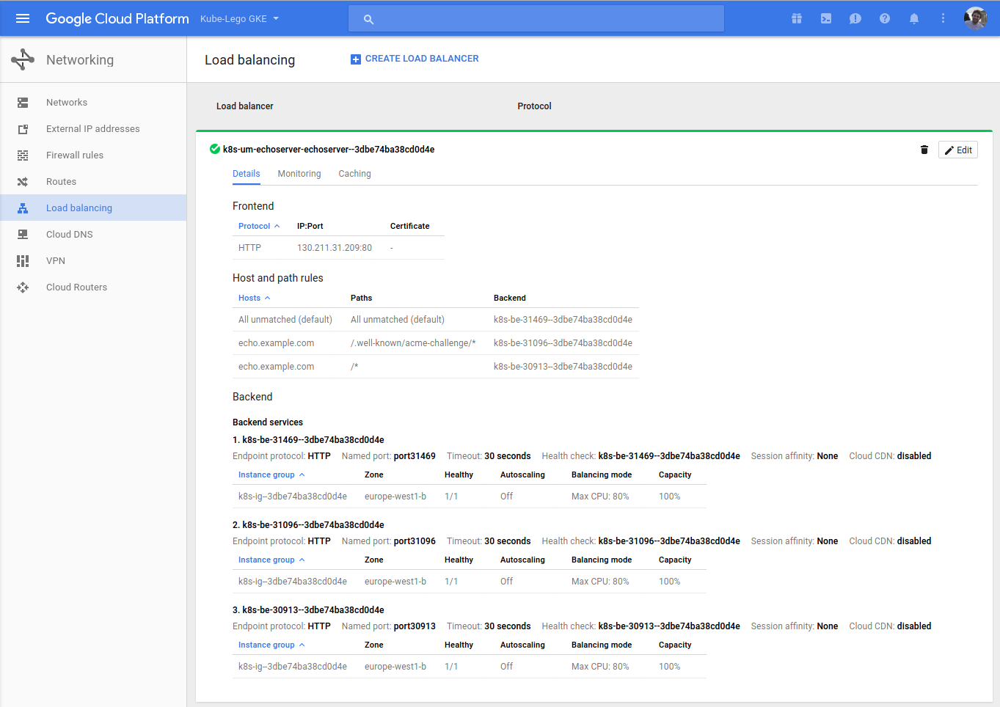

# kube-lego with GCE ingress controller

With using GKE/GCE ingress controller you hand off the HTTP routing to GCE

This examples runs kube-lego in a separate namespace

# Create the kube-lego related objects

```bash
# Namespace
kubectl apply -f lego/00-namespace.yaml
# ConfigMap (please setup you KUBE_LEGO EMAIL before deploying)
kubectl apply -f lego/configmap.yaml 
# Deployment
kubectl apply -f lego/deployment.yaml
# Service is created by kube-lego in every used namespace
```

# Create an example application `echoserver` in a separate namespace

```bash
# Namespace
kubectl apply -f echoserver/00-namespace.yaml
# Service (has to be Type=NodePort)
kubectl apply -f echoserver/service.yaml
kubectl apply -f echoserver/deployment.yaml
kubectl apply -f echoserver/ingress-tls.yaml
```

As soon as the `ingress/echoserver` resource is added to the cluster, kube-lego
will be aware of that and try to get a certificate for the domain
`echo.example.com` specified in the ingress resource. Please be aware that you
have to manually point the DNS record for `echo.example.com` to the load
balancer created.

You get the right IP address by using kubectl. (It takes +/- 10 min to deloy the ingress if is the first load balancer you're deploying on gce.):

```bash
kubectl get ingress --namespace echoserver echoserver
NAME         HOSTS              ADDRESS          PORTS     AGE
echoserver   echo.example.com   130.211.31.209   80, 443   2m
```

# Screenshot of GCE console

If you take a look at the load balancers in GCE it should look like that



# :skull: Warning!!! :skull:

Be aware that gce has a limit of 5 backend services by default, read [here](https://cloud.google.com/compute/quotas) how to increase your limits. 
Use the command below to verify if you're reaching the limits. 

```
$kubectl get events -w --all-namespaces
echoserver   2017-05-10 19:32:39 +0200 CEST   2017-05-10 19:32:21 +0200 CEST   11        echoserver   Ingress             Warning   GCE :Quota   {loadbalancer-controller }   googleapi: Error 403: Quota 'BACKEND_SERVICES' exceeded. Limit: 5.0, quotaExceeded
```